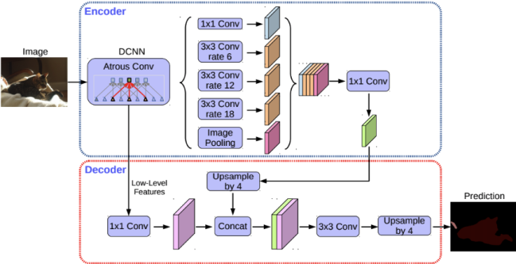
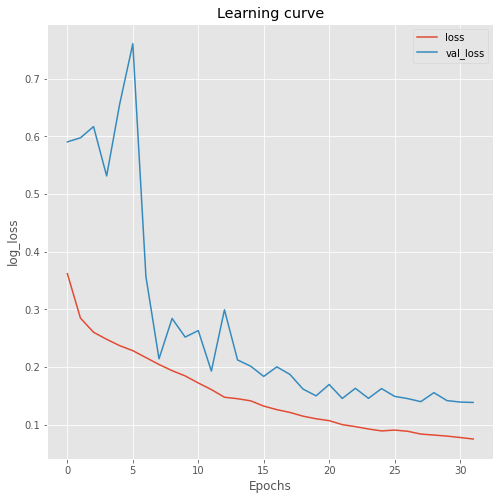
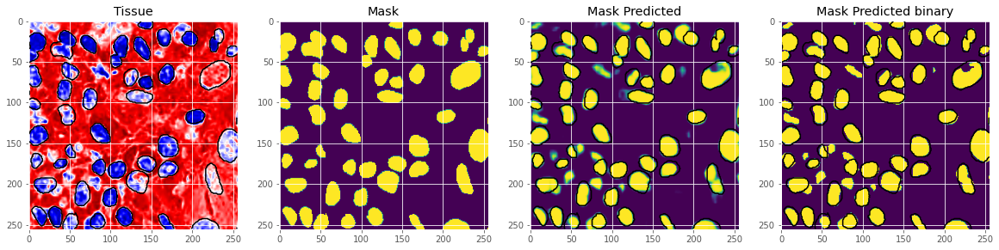
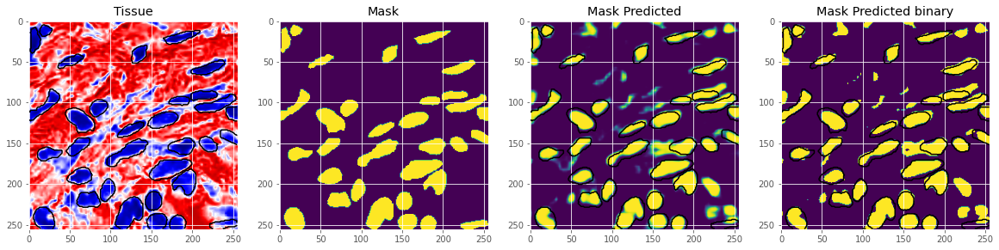
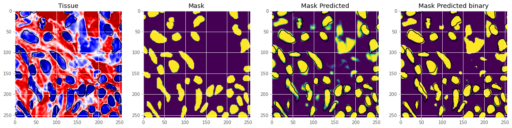

# Table of Content
[Introduction](https://github.com/shoaibsattar823/CS893-Semantic-Segmentation/blob/master/README.md#cs893-semantic-segmentation)

[1. U-Net](https://github.com/shoaibsattar823/CS893-Semantic-Segmentation/blob/master/README.md#1-u-net)

[2. SegNet](https://github.com/shoaibsattar823/CS893-Semantic-Segmentation/blob/master/README.md#2-segnet)

[3. DeepLab-v3](https://github.com/shoaibsattar823/CS893-Semantic-Segmentation/blob/master/README.md#3-deeplab-v3)

# CS893-Semantic-Segmentation
Semantic Segmentation is the classification of images on pixel level. The purpose is to understand and recognize what is in the image in pixel level. Semantic Segmentation has wide range of applications such as Robot Vision and Understanding, Autonomous Driving and Medical Purposes.
In this project, I am doing semantic segmentation on [MonuSeg Dataset](https://monuseg.grand-challenge.org/Data/) using different segmentation techniques/architectures which are U-Net, Segnet and DeepLab-v3.

## 1. U-Net
(Modified the original implementation at https://github.com/hlamba28/UNET-TGS/blob/master/TGS%20UNET.ipynb for this dataset)

###### Model Diagram

###### Training Settings
* Input Size: 1024x1024
* Optimizer: SGD
* Learning Rate: 0.001
* Batch Size: 5
* Epochs: 50

###### Evaluation
* Accuracy = 0.82
* Dice Score = 0.41

###### Learning Curve

###### Visualization

## 2. SegNet

###### Model Diagram

###### Training Settings
* Input: 256x256 size images for training which are actually patches of original 1000x1000 size image.
* Optimizer: Adam
* Batch Size: 16
* Epochs: 50

###### Evaluation
* Accuracy = 0.58
* Dice Score = 0.35
* F1-Score = 0.43
* Loss (Binary Crossentropy) = 0.82

###### Learning Curve

###### Visualization

## 3. DeepLab-v3

###### Model Diagram

###### Training Settings
* Input Size: 256x256 patches from original 1000x1000 image
* Optimizer: Adam
* Batch Size: 8
* Epochs: 32

###### Evaluation
* Accuracy = 0.8968995
* Dice Score = 0.74143386
* F1-Score = 0.75504327
* Loss (Binary Crossentropy) = 0.3610503834391397

###### Learning Curve

###### Visualization

